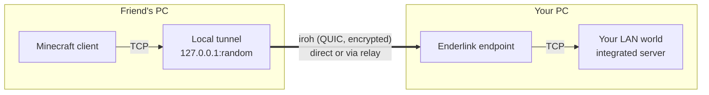

<div align="center">

# Neoz's Enderlink

**Play with your friends from anywhere. No port forwarding, no servers, no VPNs.**

Open your singleplayer world to LAN, flip one switch, and share a key.
Your friends paste it into *Direct Connection* and join, like an Ender Pearl through the internet.

[](https://github.com/neozmmv/neoz-enderlink/releases)
[](https://github.com/neozmmv/neoz-enderlink/actions)


</div>

---

## What it does

Vanilla *Open to LAN* only works for people on your local network. **Enderlink** makes it work over the internet by tunneling the connection through [iroh](https://iroh.computer), a peer-to-peer networking library that punches through NATs and firewalls for you.

- **A permanent key per player.** Generated on first launch and reused afterwards, so friends can save your world in their server list.
- **One switch.** *Share via Enderlink* lives right next to the LAN option in **World Options**.
- **Direct when possible, relayed when not.** iroh tries to connect peers directly (hole punching) and falls back to a relay server if it can't.
- **End-to-end encrypted.** Connections are QUIC + TLS between the two players' keys. Relays only ever see encrypted packets.
- **Vanilla-friendly.** It's still the regular integrated server: Mojang login, game modes, and LAN settings all behave as usual.

## Installation

1. Install [Fabric Loader](https://fabricmc.net/use/) for **Minecraft 26.1, 26.2 or 26.3**.
2. Drop [Fabric API](https://modrinth.com/mod/fabric-api) into your `mods` folder.
3. Download the latest `neoz_enderlink-x.y.z+<minecraft version>.jar` matching your game version from [**Releases**](https://github.com/neozmmv/neoz-enderlink/releases) and put it in `mods` too.

That's it: iroh and its Kotlin runtime are bundled inside the jar. Both the host and the players joining need the mod.

> **Supported platforms:** Windows x64 · Linux x64 / arm64 · macOS Apple Silicon
> *(Intel Macs aren't supported by iroh's prebuilt binaries.)*

## How to play

### Hosting a world

1. Open your world and press **Esc** → **World Options**.
2. Under **Multiplayer**, turn **LAN** on.
3. Turn **Share via Enderlink** on and hit **Apply Changes**.
4. Chat shows your key:

   ```
   World shared via Enderlink. Key: upzdrisqct7vmti7x7zuxesh4ykfutmjo6fv3j2ccf5l2lauloxq
   ```

   Click it to copy, then send it to your friends.

Turning the switch (or LAN) off, running `/unpublish`, or closing the world stops sharing and disconnects Enderlink players.

### Joining a friend

1. **Multiplayer** → **Direct Connection** (or **Add Server** to keep it in your list).
2. Paste your friend's key as the server address.
3. **Join Server**.

## How it works



- Every game launch binds an **iroh endpoint** whose identity is your key.
- When Minecraft resolves a server address that's an Enderlink key, the mod swaps it for a local tunnel instead of doing a DNS lookup. The server list ping goes through the same tunnel, so the world shows its MOTD and player count.
- On the host, each incoming Minecraft connection arrives as an iroh stream and is forwarded to the LAN port. The integrated server just sees a normal local connection.
- The key is your iroh endpoint id written in base32 (52 characters) instead of the usual hex (64). Minecraft rejects address segments longer than 63 characters, and the shorter form keeps the key valid in the address box.

## FAQ

<details>
<summary><b>Is my world open to everyone once the mod is installed?</b></summary>

No. Incoming connections are refused unless *Share via Enderlink* is on, and it starts **off** every time. Anyone joining also still needs your key and a valid Minecraft account.
</details>

<details>
<summary><b>Where is my key stored? Can I reset it?</b></summary>

The secret is kept in `<game directory>/neoz_enderlink/iroh_secret_key`. Delete that file and a new key is generated on the next launch. **Don't share this file.** Anyone who has it can pretend to be you. It's deliberately stored outside `config/` so modpacks don't hand every player the same identity.
</details>

<details>
<summary><b>My friend gets "Invalid session" when joining.</b></summary>

That's Minecraft's account check, not Enderlink: the integrated server always runs in online mode. Make sure both players are logged in with a real Minecraft account and try restarting the launcher.
</details>

<details>
<summary><b>Does it work with a dedicated server?</b></summary>

Not yet. Enderlink currently shares singleplayer worlds opened to LAN.
</details>

## Building from source

```sh
git clone https://github.com/neozmmv/neoz-enderlink
cd neoz-enderlink
./gradlew build          # jar lands in build/libs/
```

Requires **JDK 25**. Handy tasks for development:

| Task | What it does |
| --- | --- |
| `./gradlew runClient` | Launch a dev client (game dir `run/`) |
| `./gradlew runClient2` | Launch a second client with its own game dir and key (`run2/`) to test joining on one machine |
| `./gradlew genSources` | Decompile Minecraft for reading/navigating its code |

> Two dev clients can connect through Enderlink, but the final login fails with *Invalid session* because dev clients don't have real Mojang accounts. Use two real accounts to test a full join.

Pushing a tag (e.g. `v1.2.0`) triggers the release workflow, which builds the jar with that version and publishes it as **Neoz's Enderlink v1.2.0**.

### A note on Java + iroh

iroh's JVM bindings ([`computer.iroh:iroh`](https://central.sonatype.com/artifact/computer.iroh/iroh)) are generated Kotlin, but this mod is written in plain Java. The glue lives in [`src/main/java/.../iroh`](src/main/java/io/github/neozmmv/enderlink/iroh):

- **`IrohAsync`** turns Kotlin `suspend` functions into `CompletableFuture`s (and back, for callbacks).
- **`IrohStreams`** reaches methods Java can't call by name. Kotlin mangles functions with unsigned parameters (e.g. `read-qim9Vi0`), so they're called through `MethodHandle`s.
- **`IrohKeys`** handles the base32 key format.

## Credits

- [**iroh**](https://iroh.computer) by [n0](https://n0.computer): the peer-to-peer magic underneath.
- [**Fabric**](https://fabricmc.net): the mod loader and API.

## License

Released under [CC0 1.0](LICENSE): do whatever you like with it.
